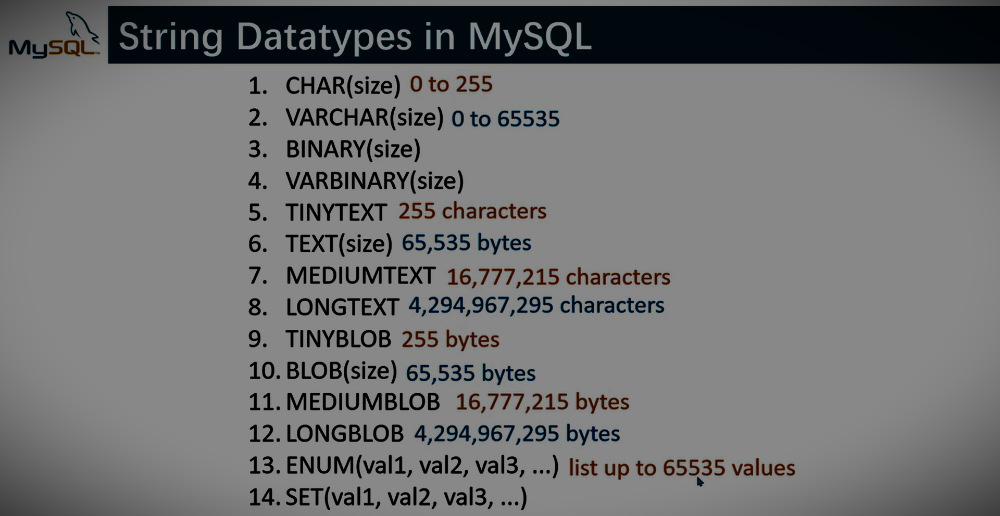

# LearningMysql

<code align=center></code>

## Structured Query Language.

* This repository clone
### `https://github.com/vckindarkhediya/LearningMysql.git`

## Mysql commands

### String datatypes in sql 
<code align=center></code>

### Numeric datatypes in sql 
<code align=center></code>

### Date and Time datatypes in sql 
<code align=center></code>

* [create database ](https://github.com/vckindarkhediya/LearningMysql/blob/mysql/Day-1-Learning/index.html)
* [create table ](https://github.com/vckindarkhediya/LearningMysql/blob/mysql/Day-2-Learning/index.html)
* [insert data table](https://github.com/vckindarkhediya/LearningMysql/blob/mysql/Day-3-Learning/index.html)
* [constraints](https://github.com/vckindarkhediya/LearningMysql/blob/mysql/Day-4-Learning/index.html)
<code align=center></code>

* [select table data / select table column data](https://github.com/vckindarkhediya/LearningMysql/blob/mysql/Day-5-Learning/index.html)
* [select columnName rename](https://github.com/vckindarkhediya/LearningMysql/blob/mysql/Day-6-Learning/index.html)
* [select table data condition base](https://github.com/vckindarkhediya/LearningMysql/blob/mysql/Day-7-Learning/index.html)
* [select table and, or, not condition](https://github.com/vckindarkhediya/LearningMysql/blob/mysql/Day-8-Learning/index.html)
* [select table in operator](https://github.com/vckindarkhediya/LearningMysql/blob/mysql/Day-9-Learning/index.html)
* [select table between operator](https://github.com/vckindarkhediya/LearningMysql/blob/mysql/Day-10-Learning/index.html)
* [select table like operator with wildcards](https://github.com/vckindarkhediya/LearningMysql/blob/mysql/Day-11-Learning/index.html)
<code align=center></code>

* [regular expression patterns](https://github.com/vckindarkhediya/LearningMysql/blob/mysql/Day-12-Learning/index.html)
<code align=center></code>

* [select table orderby & distinct](https://github.com/vckindarkhediya/LearningMysql/blob/mysql/Day-13-Learning/index.html)

* [select count](https://github.com/vckindarkhediya/LearningMysql/blob/mysql/Day-14-Learning/index.html)