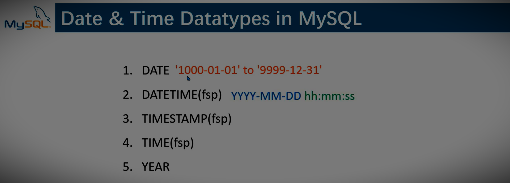

# LearningMysql

<code align=center></code>

## Structured Query Language.

* This repository clone
### `https://github.com/vckindarkhediya/LearningMysql.git`

## Mysql commands

** String datatypes in sql **
<code align=center></code>

** Numeric datatypes in sql **
<code align=center></code>

** Date and Time datatypes in sql **
<code align=center></code>

* [Database create ](https://github.com/vckindarkhediya/LearningMysql/blob/mysql/Day-1-Learning/index.html)
* [Create table ](https://github.com/vckindarkhediya/LearningMysql/blob/mysql/Day-2-Learning/index.html)
* 
* 
* 
* 
* 
* 
* 
* 
* 
* 